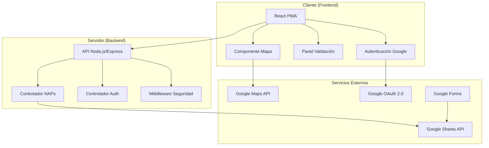
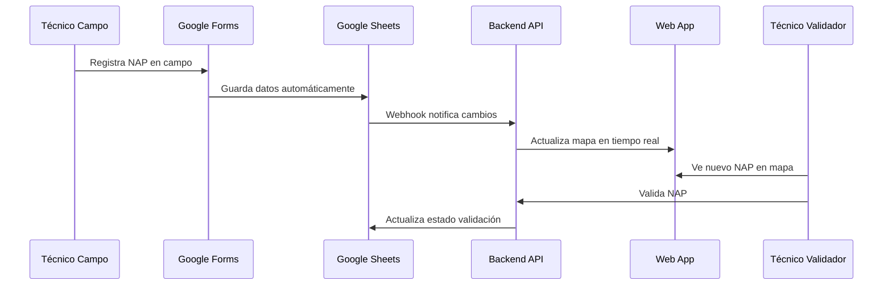

# Documento de Diseño - Sistema de Gestión de NAPs

## Visión General

El Sistema de Gestión de NAPs es una aplicación web progresiva (PWA) construida con arquitectura de cliente-servidor que integra servicios de Google (Forms, Sheets, Maps) para proporcionar una solución completa de gestión de Network Access Points. La aplicación utiliza React.js en el frontend, Node.js en el backend, y se despliega como una aplicación web responsive accesible desde cualquier dispositivo.

## Arquitectura

### Arquitectura General del Sistema



### Flujo de Datos



## Componentes e Interfaces

### Frontend (React PWA)

#### 1. Componente MapView
- **Propósito**: Visualización interactiva de NAPs en Google Maps
- **Props**: 
  - `naps`: Array de objetos NAP
  - `onMarkerClick`: Función callback para selección de marcadores
  - `filterState`: Estado actual del filtro
- **Estado**: 
  - `selectedNap`: NAP actualmente seleccionado
  - `mapCenter`: Centro actual del mapa
  - `zoomLevel`: Nivel de zoom del mapa

#### 2. Componente ValidationPanel
- **Propósito**: Panel para validación de NAPs por técnicos
- **Props**:
  - `pendingNaps`: Lista de NAPs pendientes
  - `onValidate`: Función para procesar validaciones
- **Estado**:
  - `selectedNapForValidation`: NAP en proceso de validación
  - `validationComments`: Comentarios de validación

#### 3. Componente AuthProvider
- **Propósito**: Manejo de autenticación con Google OAuth
- **Context**: Proporciona estado de autenticación global
- **Métodos**:
  - `login()`: Inicia proceso de autenticación
  - `logout()`: Cierra sesión del usuario
  - `checkAuthStatus()`: Verifica estado de autenticación

#### 4. Componente NapDetails
- **Propósito**: Mostrar información detallada de un NAP
- **Props**:
  - `nap`: Objeto NAP con toda la información
  - `canValidate`: Boolean indicando permisos de validación

### Backend (Node.js/Express)

#### 1. Controlador NAPs (`/api/naps`)
```javascript
// Endpoints principales
GET /api/naps - Obtener todos los NAPs
GET /api/naps/:id - Obtener NAP específico
PUT /api/naps/:id/validate - Validar un NAP
GET /api/naps/pending - Obtener NAPs pendientes de validación
```

#### 2. Controlador Autenticación (`/api/auth`)
```javascript
// Endpoints de autenticación
POST /api/auth/google - Autenticación con Google OAuth
GET /api/auth/profile - Obtener perfil del usuario
POST /api/auth/logout - Cerrar sesión
```

#### 3. Servicio Google Sheets
- **Propósito**: Interfaz con Google Sheets API
- **Métodos**:
  - `getAllNaps()`: Obtiene todos los NAPs de la hoja
  - `updateNapStatus()`: Actualiza estado de validación
  - `listenForChanges()`: Escucha cambios en tiempo real

#### 4. Middleware de Seguridad
- **Autenticación JWT**: Validación de tokens de sesión
- **CORS**: Configuración de políticas de origen cruzado
- **Rate Limiting**: Limitación de peticiones por usuario
- **Validación de Datos**: Sanitización de inputs

## Modelos de Datos

### Modelo NAP
```typescript
interface NAP {
  id: string;
  coordinates: {
    latitude: number;
    longitude: number;
  };
  status: 'pendiente' | 'en_construccion' | 'activo' | 'validado' | 'rechazado';
  registeredBy: string;
  registrationDate: Date;
  validatedBy?: string;
  validationDate?: Date;
  validationComments?: string;
  observations: string;
  photos?: string[];
  municipality: string;
  sector: string;
}
```

### Modelo Usuario
```typescript
interface User {
  id: string;
  email: string;
  name: string;
  role: 'tecnico_campo' | 'tecnico_validador' | 'administrador';
  googleId: string;
  lastLogin: Date;
}
```

### Configuración Google Sheets
```typescript
interface SheetsConfig {
  spreadsheetId: string;
  range: string;
  columns: {
    id: string;
    latitude: string;
    longitude: string;
    status: string;
    registeredBy: string;
    registrationDate: string;
    // ... otros campos
  };
}
```

## Manejo de Errores

### Estrategia de Manejo de Errores

#### Frontend
- **Error Boundaries**: Captura errores de React y muestra UI de fallback
- **Retry Logic**: Reintento automático para peticiones fallidas
- **Offline Support**: Funcionalidad básica sin conexión usando Service Workers
- **User Feedback**: Notificaciones toast para errores y éxitos

#### Backend
- **Error Middleware**: Captura y formatea errores de manera consistente
- **Logging**: Registro detallado de errores con Winston
- **Graceful Degradation**: Funcionalidad reducida cuando servicios externos fallan

### Códigos de Error Específicos
```javascript
const ERROR_CODES = {
  SHEETS_CONNECTION_FAILED: 'SHEETS_001',
  INVALID_COORDINATES: 'NAP_001',
  UNAUTHORIZED_VALIDATION: 'AUTH_001',
  MAPS_API_LIMIT_EXCEEDED: 'MAPS_001'
};
```

## Estrategia de Testing

### Testing Frontend
- **Unit Tests**: Jest + React Testing Library para componentes
- **Integration Tests**: Testing de flujos completos usuario-aplicación
- **E2E Tests**: Cypress para testing de funcionalidades críticas
- **Visual Regression**: Chromatic para detectar cambios visuales

### Testing Backend
- **Unit Tests**: Jest para lógica de negocio y servicios
- **API Tests**: Supertest para endpoints REST
- **Integration Tests**: Testing con Google APIs usando mocks
- **Load Tests**: Artillery para testing de rendimiento

### Casos de Prueba Críticos
1. **Registro de NAP**: Flujo completo desde Google Forms hasta visualización
2. **Validación en Tiempo Real**: Actualización inmediata del mapa
3. **Autenticación**: Login/logout con Google OAuth
4. **Sincronización**: Bidireccional con Google Sheets
5. **Responsive Design**: Funcionalidad en móviles y desktop

## Consideraciones de Seguridad

### Autenticación y Autorización
- **OAuth 2.0**: Integración con Google para autenticación segura
- **JWT Tokens**: Tokens de sesión con expiración automática
- **Role-Based Access**: Control de acceso basado en roles de usuario
- **HTTPS Only**: Todas las comunicaciones cifradas

### Protección de Datos
- **Input Validation**: Sanitización de todos los inputs del usuario
- **SQL Injection Prevention**: Uso de queries parametrizadas
- **XSS Protection**: Sanitización de contenido renderizado
- **CSRF Protection**: Tokens CSRF para formularios críticos

### APIs Externas
- **API Key Management**: Claves de API almacenadas como variables de entorno
- **Rate Limiting**: Límites de peticiones para prevenir abuso
- **Error Handling**: No exposición de información sensible en errores

## Configuración de Despliegue

### Entorno de Desarrollo
```yaml
# docker-compose.dev.yml
version: '3.8'
services:
  frontend:
    build: ./frontend
    ports:
      - "3000:3000"
    environment:
      - REACT_APP_API_URL=http://localhost:5000
      - REACT_APP_GOOGLE_MAPS_API_KEY=${GOOGLE_MAPS_API_KEY}
  
  backend:
    build: ./backend
    ports:
      - "5000:5000"
    environment:
      - NODE_ENV=development
      - GOOGLE_SHEETS_API_KEY=${GOOGLE_SHEETS_API_KEY}
      - JWT_SECRET=${JWT_SECRET}
```

### Entorno de Producción
- **Frontend**: Despliegue en Vercel o Netlify con CDN
- **Backend**: Despliegue en Railway, Heroku o DigitalOcean
- **Base de Datos**: Google Sheets como fuente de verdad
- **Monitoreo**: Sentry para tracking de errores
- **Analytics**: Google Analytics para métricas de uso

### Variables de Entorno Requeridas
```bash
# Google APIs
GOOGLE_MAPS_API_KEY=your_maps_api_key
GOOGLE_SHEETS_API_KEY=your_sheets_api_key
GOOGLE_OAUTH_CLIENT_ID=your_oauth_client_id
GOOGLE_OAUTH_CLIENT_SECRET=your_oauth_client_secret

# Aplicación
JWT_SECRET=your_jwt_secret
SPREADSHEET_ID=your_google_sheets_id
NODE_ENV=production
PORT=5000
```

## Optimizaciones de Rendimiento

### Frontend
- **Code Splitting**: Carga lazy de componentes no críticos
- **Image Optimization**: Compresión automática de fotos de NAPs
- **Caching**: Service Workers para cache de recursos estáticos
- **Bundle Optimization**: Tree shaking y minificación

### Backend
- **Response Caching**: Cache de respuestas de Google Sheets API
- **Connection Pooling**: Reutilización de conexiones HTTP
- **Compression**: Gzip para respuestas de API
- **Database Indexing**: Optimización de queries en Google Sheets

### Monitoreo
- **Performance Metrics**: Core Web Vitals tracking
- **API Response Times**: Monitoreo de latencia de endpoints
- **Error Rates**: Tracking de errores por funcionalidad
- **User Analytics**: Métricas de uso y adopción